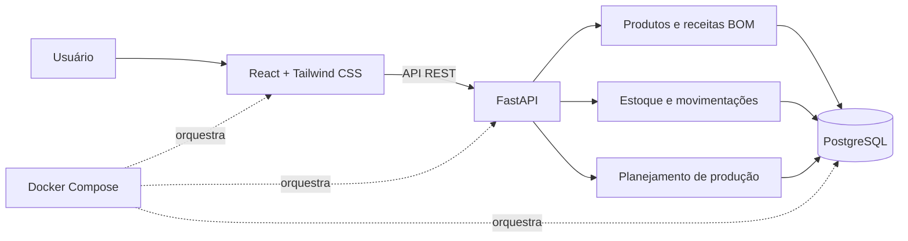

# Arquitetura do StockMaster

## Responsabilidades

- O frontend oferece dashboard, cadastros e fluxos de movimentação.
- A API separa endpoints, schemas e modelos de persistência.
- A regra de planejamento cruza receitas de fabricação com o estoque disponível.
- O PostgreSQL mantém produtos, matérias-primas, receitas e movimentações.
- O Docker Compose reproduz a aplicação e suas dependências localmente.

