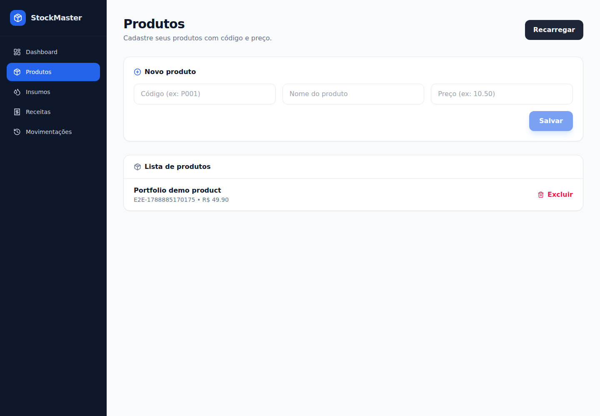
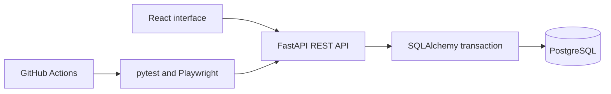

# StockMaster — Production & Inventory API

Full-stack inventory and production-planning project by Karen Denich de Angelis Rosa.

StockMaster helps a small manufacturer maintain products, raw materials and recipes, record stock movements, and estimate what can be produced from available materials. The interface is in Portuguese; this technical overview is in English.

## Evidence you can inspect

| Capability | Evidence |
| --- | --- |
| API contracts | `tests/test_products.py`: successful creation/read, invalid input and missing product |
| Business invariants | `tests/test_stock_movements.py`: insufficient stock, exact withdrawal, invalid quantity and rollback after real SQL writes |
| Full-stack flow | `frontend/e2e/products.spec.js`: open UI, create product, reload, verify persisted record through the real API |
| Continuous integration | [API and E2E workflow](../../actions/workflows/quality.yml), with JUnit, HTML report, screenshots and video artifacts |
| Deployment | [Deployment guide](docs/deployment.md), plus explicitly isolated browser demo mode |

The Playwright workflow uploads `test-evidence` for 14 days. Open the completed run, download the artifact, and open `frontend/playwright-report/index.html`; screenshots and a short recording of the real product-creation flow are included. A failure is visible in Actions rather than being recorded as a successful test.

## Product flow



[Watch the short automated product-creation recording](docs/media/stockmaster-product-demo.webm). Captured from the passing [GitHub Actions run](https://github.com/KarenAngelis/production-stock-api/actions/runs/34251580407), using fictional data and the real API. The automated recording is approximately two seconds long.

## Architecture and decisions



- **React + Tailwind:** product, material, recipe, movement and production views.
- **FastAPI + Pydantic:** REST contracts and request validation.
- **SQLAlchemy + PostgreSQL:** relationships, unique product codes and transactional stock updates.
- **SQLite test databases:** isolated and disposable; no tests use a developer or company database.
- **Atomic movements:** balance update and movement insert share one transaction. A database failure rolls both back; internal database details are not returned to the client.
- **Row locking:** movement reads use `SELECT FOR UPDATE` on PostgreSQL. SQLite cannot prove PostgreSQL concurrency behavior, so concurrency testing remains a separate integration task.
- **Production suggestion:** greedy allocation prioritizes higher unit prices and consumes shared raw materials in the calculation only. It is an estimate, not a guarantee of maximum profit or an executed production order.

## Run locally

Use Python 3.12 and Node.js 22. From the repository root:

```bash
python -m venv .venv
source .venv/bin/activate
python -m pip install -r requirements-test.txt
python -m pytest -v
python -m uvicorn app.main:app --host 127.0.0.1 --port 8000
```

On Windows, activate with `.venv\Scripts\activate`. Without `DATABASE_URL`, the API uses local SQLite for development. For PostgreSQL, set `DATABASE_URL` and `STRICT_DB=1`; see the deployment guide. The API documentation is at `http://127.0.0.1:8000/docs`.

In another terminal:

```bash
cd frontend
npm ci
npm start
```

Open `http://localhost:3000`. The default API endpoint is `http://127.0.0.1:8000`. Override it with `REACT_APP_API_URL` before starting/building the frontend.

## Run the browser regression

Stop existing services on ports 3000 and 8000 first. Keep the Python virtual environment active:

```bash
cd frontend
npx playwright install chromium
npm run test:e2e
```

Playwright starts the real API with a temporary SQLite database and the React application, then shuts its servers down. It does not use the browser-only demo adapter. Linux CI installs browser system dependencies with `npx playwright install --with-deps chromium`.

## Try the isolated portfolio demo

[Open the private demo](https://stockmaster-karen-demo.kdenich16.chatgpt.site) — owner access required; not yet a public recruiter link.

```bash
cd frontend
REACT_APP_DEMO_MODE=true npm run build
```

This optional build reuses the real interface with fictional data stored in the current browser tab. It supports product/material/recipe management, stock movements and production suggestions. The banner identifies the mode and lets you reset the data. It has no live API, user accounts or shared database. The normal build uses FastAPI. Never enter real business or personal data in the demo.

## Verification and scope

The API suite passed locally on Python 3.12: **8 tests**. The [GitHub Actions run](https://github.com/KarenAngelis/production-stock-api/actions/runs/34251580407) also passed all 8 API tests and the full-stack Playwright test. CI is the source of truth for each published revision. Four dependency deprecation warnings remain. A normal production frontend build was verified locally. Docker execution was not verified in this environment because Docker is unavailable.

StockMaster is a portfolio project. Its API currently has no authentication, and it must not be exposed with real inventory data. Before a shared production rollout: add authorization, migrations, server-side validation of all business entities, PostgreSQL concurrency/integration tests, backups and operational monitoring. The browser demo does not assert those capabilities.

## Study through implementation

1. Explain when the CI runs and deliberately break a test on a practice branch.
2. Extend the Playwright flow with an invalid price and verify the visible error.
3. Explain why a flushed SQL change disappears after rollback.
4. Compare a stock calculation with and without a database row lock.
5. Reproduce the application from the setup instructions and describe a real technical decision in English.

[Detailed API test notes](docs/fastapi-testing.md) · [Original Portuguese README](docs/README.pt-BR.md)
